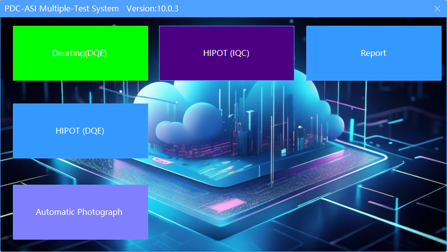
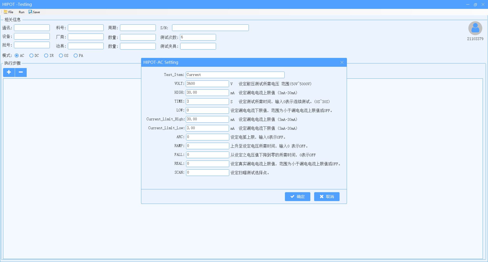
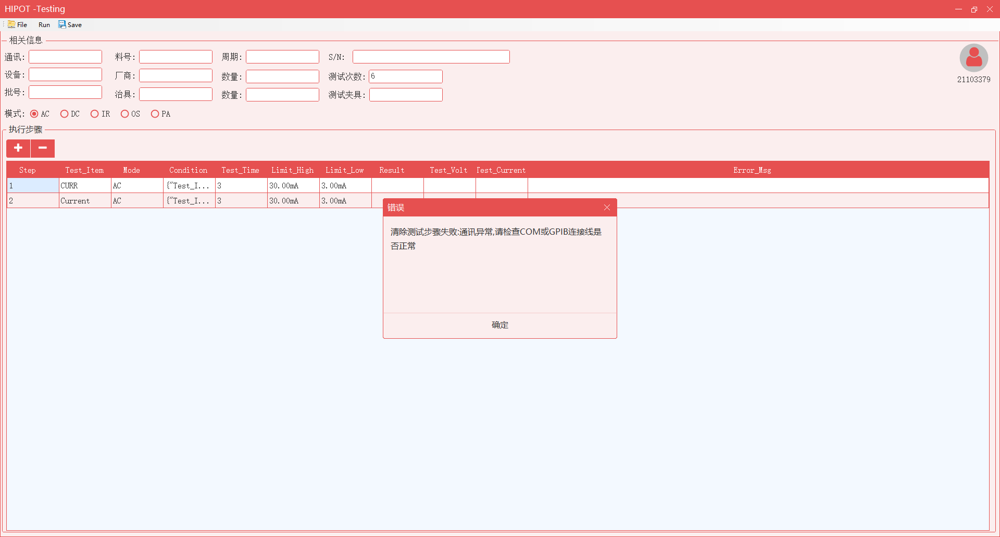
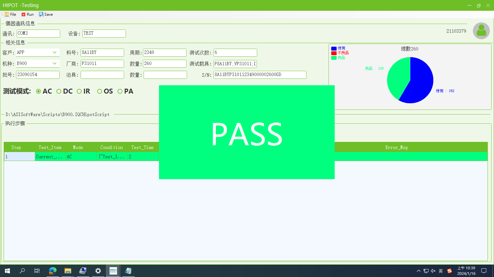
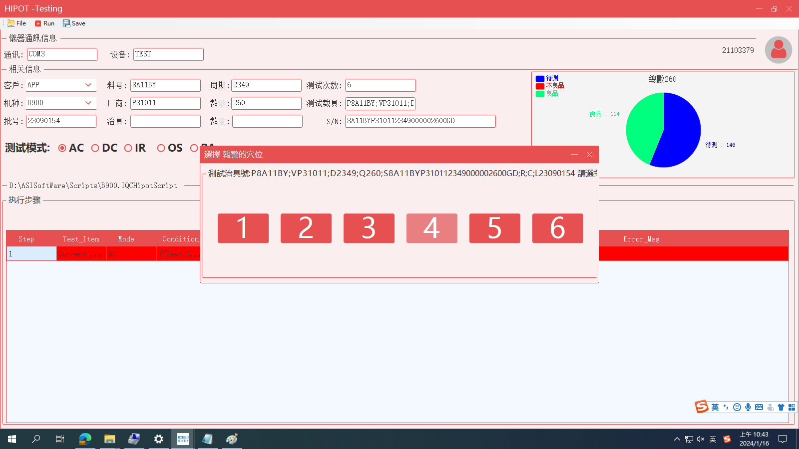

# Multiple-Test  
# 适用于DQE 实验室 ATE/HIPOT 测试 IQC HIPOT 测试
# DQE 自动拍照系统
# *--------------------------------------------------------------
# * 版权所有 (c) 2023 光寶電源科技有限公司 NJRN 保留所有权利。
# * CLR版本：4.0.30319.42000
# * 公司名称：光寶電源科技有限公司
# * 创建者：Shengbi
# * 电子邮箱：yysvent@163.com
# * 创建时间：2023/12/13 08:46:20
# * SDK = .NET Framework 4.5
# * C# 
# * --------------------------------------------------------------
# * 修改人：Shengbi
# * 时间： 2023/12/13 19:52:26
# * 版本：V1.0.1
# * 修改说明：
# * 1.主框架设计版本发布
# 
# *--------------------------------------------------------------

# * -------------------------------------------------------------
# * 修改人：Shengbi
# * 时间： 2023/12/16 19:52:26
# * 版本：V1.0.2
# * 修改说明：
# * 1.增加ATE 测试模块
# * 2.增加AC Source/ DC Load/PowerMeter/Ocilliscope GBIB 控制方式
# * 3.ATE 测试模组自动添加功能 
# * 4.增加AC /DC /PowerMeter /Ocilliscope 组合功能
# *-------------------------------------------------------------

# * -------------------------------------------------------------
# * 修改人：Shengbi
# * 时间： 2024/01/12 14:36:00
# * 版本：V1.0.3
# * 修改说明：
# * 1.增加HIPOT Chroma 19501~19504 设备控制
# * 2.增加AC 功能测试模组
# * 3.增加测试记录 箱号测试产能功能
# * 4.增加RS232通讯模组
# * 5.增加Hipot 组合测试模组
# * 6.美化DataGridView 功能
# * 7.增加脚本概念模组
# * 8.增加Logs .CSV档 测试记录模组
# *-------------------------------------------------------------

# 系统功能选择画面

# IQC Hipot 测试
# 测试配置

# 通讯异常提醒

# 测试记录-Pass

# 测试记录-Fail

# APP 自动FW 烧录
<video controls src="af7769f4026d01551e8a2404264ea049.mp4" title="Title"></video>